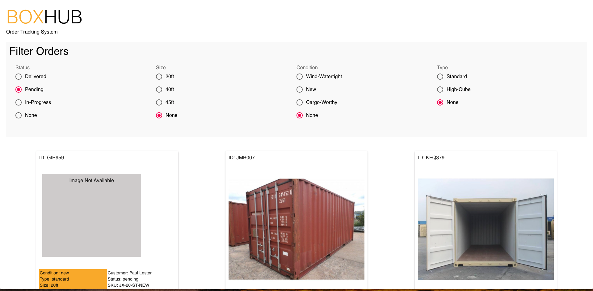
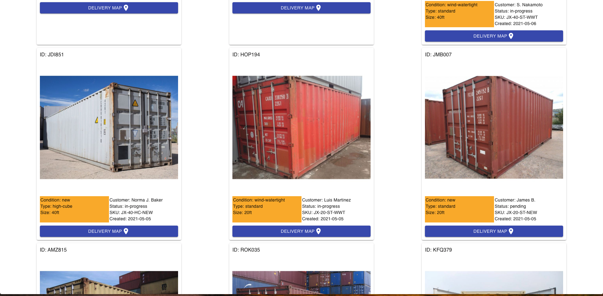

<h1 align="center">Boxhub Tech Assignment</h1>
<h2 align="center">Order Tracking System</h1>

## Purpose

This is 

1. Show to the user all orders sorted by creation date, showing the photo and some information nearby.

2. Allow the user to filter by the attributes: Status, Size, Condition and Type.

3. For every order in the list, provide a call to action that will open a popup, showing a map drawing the origin and the destination with markers.

## Deployment

Assuming the user is using software like VisualCode or Atom, do the following.

Clone the repo at `https://github.com/JoshFrechette/Boxhub_OTS.git` and open the project.

Install the necessary packages `npm i @material-ui/core @material-ui/icons react-google-maps`

Run `npm start`

## How to use

The user can filter the order cards by staus, size, condition, and type. 

  

Each order card displays all of the relevant order information.

  

On clicking the 'Delivery Map' button, a map modal will appear with directions for the delivery.

  

## Technologies Used

javascript library/framework: ReactJS

CSS Framework: Material-UI

libraries/modules:
- react-google-maps

## Known Issues

At the moment, the map modal for providing delivery directions does not work. The source of the issue lies primarily in being denied permssion from the GoogleAPI, but also finding a good library for converting traditional addresses into {lat, long} coordinates for React. 